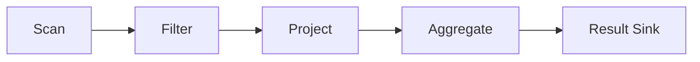

# Execution Engine

Grafeo uses a push-based, vectorized execution engine.

## Overview

## Sections

- [Push-Based Model](push-based.md)
- [Vectorized Operations](vectorized.md)
- [Adaptive Chunks](chunks.md)
