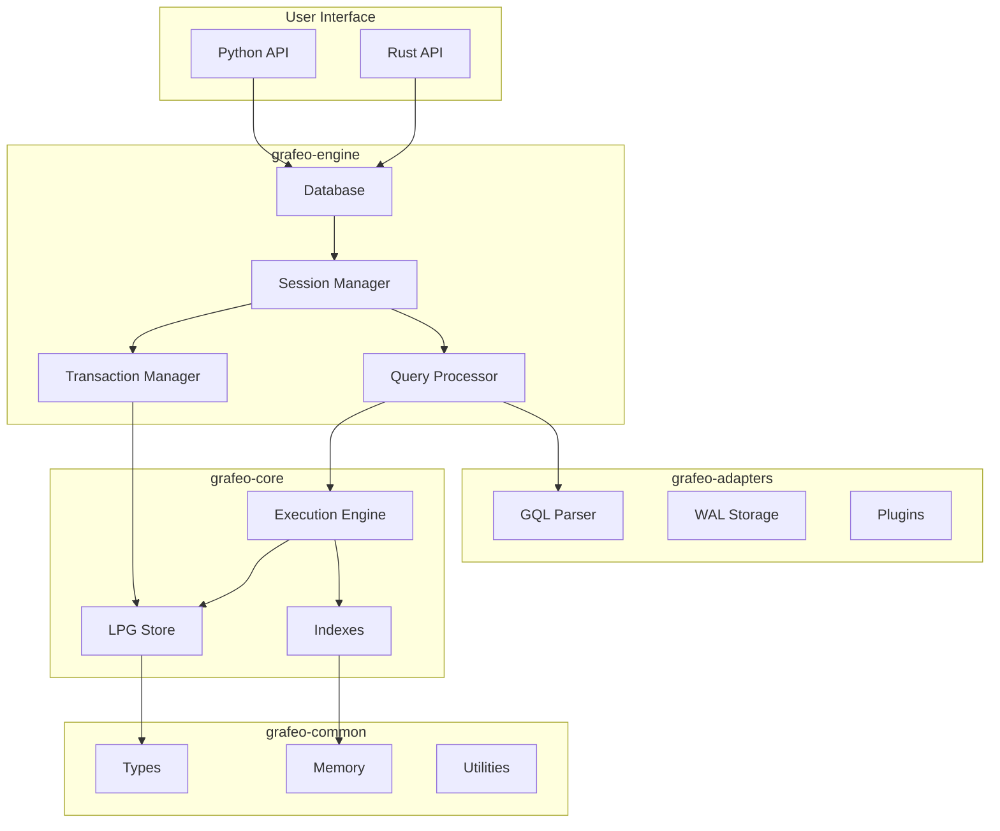

# Architecture

Understand how Grafeo is designed and implemented.

## Overview

Grafeo is built as a modular system with clear separation of concerns:

## Sections

-   **[System Overview](overview.md)**

    ---

    High-level architecture and design principles.

-   **[Crate Structure](crates.md)**

    ---

    The five crates and their responsibilities.

-   **[Storage Model](storage/index.md)**

    ---

    How data is stored and organized.

-   **[Execution Engine](execution/index.md)**

    ---

    Query execution and optimization.

-   **[Query Optimization](optimization/index.md)**

    ---

    Cost-based optimization strategies.

-   **[Memory Management](memory/index.md)**

    ---

    Memory allocation and management.

-   **[Transactions](transactions/index.md)**

    ---

    MVCC and isolation levels.

## Design Principles

1. **Performance First** - Optimized for graph workloads
2. **Embeddable** - Zero external dependencies
3. **Safe** - Written in safe Rust
4. **Modular** - Clear crate boundaries
5. **Extensible** - Plugin architecture
