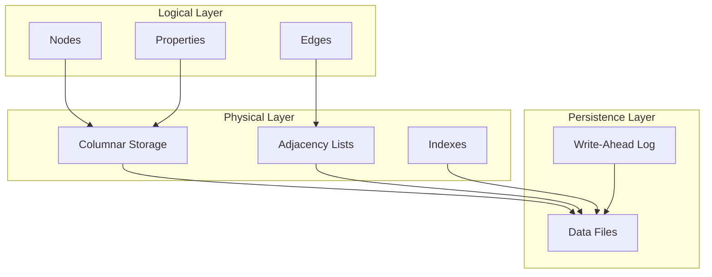

# Storage Model

Grafeo uses a hybrid storage model optimized for graph workloads.

## Overview

## Sections

-   **[Columnar Properties](columnar.md)**

    ---

    Type-specific columnar storage for properties.

-   **[Adjacency Lists](adjacency.md)**

    ---

    Chunked adjacency lists for edge traversal.

-   **[Zone Maps](zone-maps.md)**

    ---

    Statistics for data skipping.

-   **[Compression](compression.md)**

    ---

    Type-specific compression strategies.

