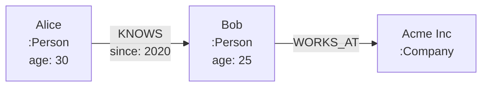

# Data Model

Graphos implements the **Labeled Property Graph (LPG)** model, the most widely used data model for graph databases.

## Overview

A Labeled Property Graph consists of:

- **Nodes** - Entities in your graph (people, products, locations)
- **Edges** - Relationships between nodes (KNOWS, PURCHASED, LOCATED_IN)
- **Labels** - Categories for nodes (Person, Product, Location)
- **Types** - Categories for edges (relationship types)
- **Properties** - Key-value pairs on nodes and edges

## Learn More

-   **[Nodes and Labels](nodes.md)**

    ---

    Understanding nodes, their labels, and multi-label support.

-   **[Edges and Types](edges.md)**

    ---

    Creating and working with edges between nodes.

-   **[Properties](properties.md)**

    ---

    Property types, values, and schema considerations.

